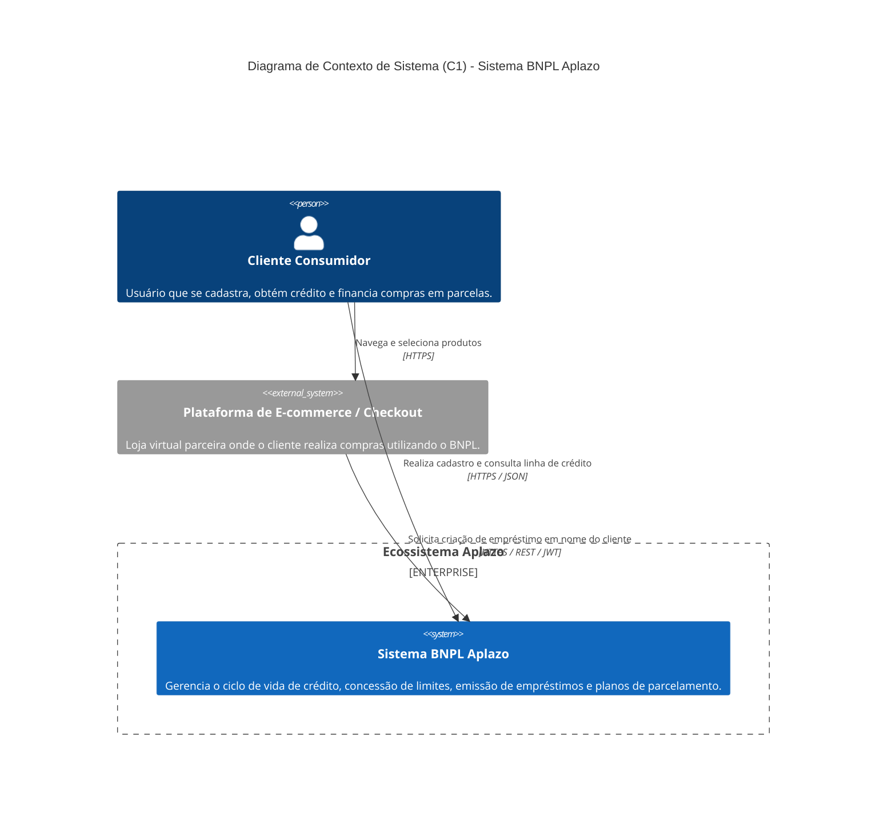
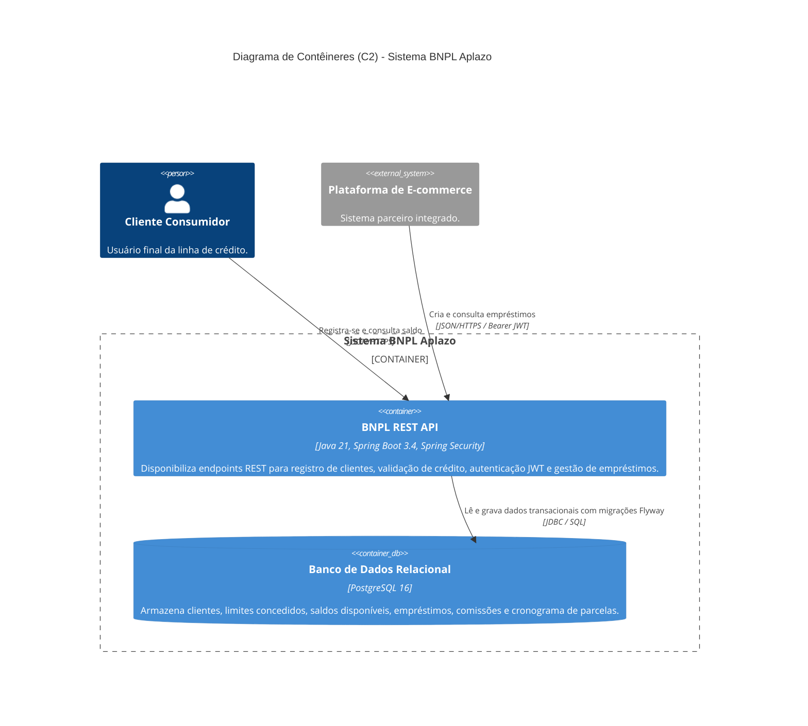

# Modelo C4 e Arquitetura do Sistema BNPL (Aplazo)

Este documento descreve a arquitetura do **Sistema Buy Now, Pay Later (BNPL)** utilizando o modelo **C4** (Contexto e Contêineres) padronizado via **Structurizr DSL** e ilustrado com diagramas **Mermaid C4**.

---

## 1. Visão Geral da Solução

O sistema tem como finalidade fornecer uma infraestrutura de crédito sob demanda (BNPL) para checkouts de e-commerce e consumidores finais:
- **Clientes Consumidores:** Cadastram-se, recebem aprovação instantânea de linha de crédito baseada em sua idade e realizam compras financiadas em 5 parcelas quinzenais.
- **Plataformas de E-commerce:** Integram-se via REST APIs seguras para oferecer pagamentos parcelados, recebendo confirmações instantâneas de liquidação do empréstimo.
- **Engine Financeira:** Calcula comissões, gerencia saldos remanescentes de crédito e estabelece o cronograma rigoroso de amortização com controle de centavos residuais.

---

## 2. Nível 1: Diagrama de Contexto de Sistema (C1)

O Diagrama de Contexto estabelece as fronteiras do sistema, destacando os atores humanos e sistemas externos com os quais a solução interage.

### 2.1 Representação Visual (Mermaid C4Context)



---

## 3. Nível 2: Diagrama de Contêineres (C2)

O Diagrama de Contêineres expande o Sistema BNPL para detalhar as aplicações, microsserviços, armazenamentos de dados e protocolos que compõem a solução em tempo de execução.

### 3.1 Representação Visual (Mermaid C4Container)



---

## 4. Especificação Structurizr DSL (`workspace.dsl`)

Abaixo está o arquivo completo em formato **Structurizr DSL** (especificação padrão da indústria para modelos C4). Ele pode ser copiado diretamente para o [Structurizr Lite](https://structurizr.com/help/lite) ou compilado via Structurizr CLI.

```dsl
workspace "Sistema BNPL Aplazo" "Arquitetura da solução de Buy Now Pay Later (BNPL)" {

    model {
        customer = person "Cliente Consumidor" "Consumidor que utiliza crédito BNPL para aquisição de produtos."
        ecommerce = softwareSystem "Plataforma de E-commerce" "Plataformas parceiras e checkouts de vendas." "External"

        bnpl = softwareSystem "Sistema BNPL Aplazo" "Gerencia concessão de crédito, criação de empréstimos e parcelamentos." {
            api = container "BNPL REST API" "Processa requisições de clientes e empréstimos, executa regras financeiras e emite JWT." "Java 21, Spring Boot 3.4"
            database = container "Banco de Dados" "Armazena registros de clientes, linhas de crédito, empréstimos e parcelas." "PostgreSQL 16" "Database"
        }

        # Relações de Contexto (C1)
        customer -> ecommerce "Compra produtos utilizando parcelamento" "HTTPS"
        customer -> bnpl "Realiza cadastro e consulta limite disponível" "HTTPS / REST"
        ecommerce -> bnpl "Envia solicitações de crédito e criação de empréstimo" "HTTPS / REST / JWT"

        # Relações de Contêineres (C2)
        customer -> api "Consome endpoints /v1/customers" "HTTPS / JSON"
        ecommerce -> api "Consome endpoints /v1/loans com token Bearer" "HTTPS / JSON"
        api -> database "Persiste e consulta clientes, empréstimos e parcelas" "JDBC / Flyway"
    }

    views {
        systemContext bnpl "C1_Contexto" "Diagrama de Contexto de Sistema (C1)" {
            include *
            autoLayout lr
        }

        container bnpl "C2_Containers" "Diagrama de Contêineres (C2)" {
            include *
            autoLayout lr
        }

        styles {
            element "Person" {
                shape Person
                background #08427b
                color #ffffff
            }
            element "Software System" {
                background #1168bd
                color #ffffff
            }
            element "External" {
                background #999999
                color #ffffff
            }
            element "Container" {
                background #438dd5
                color #ffffff
            }
            element "Database" {
                shape Cylinder
                background #2A6099
                color #ffffff
            }
        }
    }
}
```

---

## 5. Rastreabilidade de Contêineres e Componentes

| Contêiner | Responsabilidade Principal | Tecnologias Utilizadas | Padrão Arquitetural |
|---|---|---|---|
| **BNPL REST API** | Autenticação JWT, validação de elegibilidade, cálculo de esquemas e comissões, exposição REST. | Java 21 LTS, Spring Boot 3.4, Spring Security, Spring Data JPA, JJWT. | Arquitetura em camadas com serviços de domínio isolados. |
| **Banco de Dados** | Persistência atômica, integridade referencial, isolamento ACID de saldo e auditoria de timestamps. | PostgreSQL 16 Alpine, versionado via scripts Flyway. | Modelo Relacional Normalizado (3NF). |
