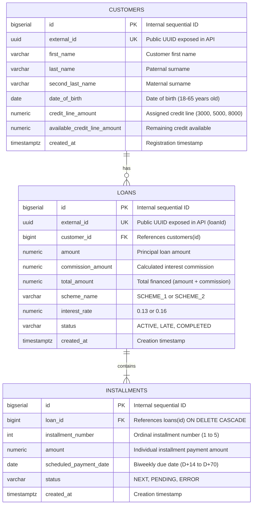

# Entity-Relationship Diagram (ERD) & Data Dictionary

This document details the database schema, entity relationships, integrity constraints, and data dictionary for the Buy Now Pay Later (BNPL) system, as specified in the [System Design Specification](superpowers/specs/2026-09-18-bnpl-system-design.md).

---

## 1. Entity-Relationship Diagram

---

## 2. Data Dictionary

### 2.1 Table: `customers`

Stores registered BNPL customer profiles, identification, and credit line allocation.

| Column Name | SQL Type | Modifiers / Constraints | Default | Business Description & Rules |
|---|---|---|---|---|
| `id` | `BIGSERIAL` | `PRIMARY KEY` | Auto-increment | Internal surrogate primary key. Used in business logic for payment scheme resolution (`id > 25`). |
| `external_id` | `UUID` | `NOT NULL UNIQUE` | None | Publicly exposed unique identifier for API endpoints (`/v1/customers/{customerId}`). Generated at registration. |
| `first_name` | `VARCHAR(100)` | `NOT NULL` | None | Customer's first name. Evaluated for payment scheme resolution (names starting with 'C', 'L', 'H' qualify for `SCHEME_1`). |
| `last_name` | `VARCHAR(100)` | `NOT NULL` | None | Paternal surname (primer apellido). |
| `second_last_name` | `VARCHAR(100)` | `NOT NULL` | None | Maternal surname (segundo apellido). |
| `date_of_birth` | `DATE` | `NOT NULL` | None | Birth date. Used to determine eligibility (must be between 18 and 65 years old inclusive). |
| `credit_line_amount` | `NUMERIC(15, 2)` | `NOT NULL` | None | Initial credit line granted: $3,000.00 (age 18-25), $5,000.00 (age 26-30), $8,000.00 (age 31-65). |
| `available_credit_line_amount` | `NUMERIC(15, 2)` | `NOT NULL` | None | Current credit limit available for purchases. Initialized equal to `credit_line_amount`; decremented atomically on loan approval. |
| `created_at` | `TIMESTAMPTZ` | `NOT NULL` | `CURRENT_TIMESTAMP` | System timestamp when the customer record was created. |

#### Indexes & Constraints (`customers`):
- `PRIMARY KEY (id)`
- `UNIQUE CONSTRAINT uk_customers_external_id (external_id)`
- `INDEX idx_customers_external_id ON customers(external_id)`

---

### 2.2 Table: `loans`

Stores credit operations (loans/purchases) contracted by customers.

| Column Name | SQL Type | Modifiers / Constraints | Default | Business Description & Rules |
|---|---|---|---|---|
| `id` | `BIGSERIAL` | `PRIMARY KEY` | Auto-increment | Internal surrogate primary key. |
| `external_id` | `UUID` | `NOT NULL UNIQUE` | None | Publicly exposed unique identifier for API endpoints (`/v1/loans/{loanId}`). |
| `customer_id` | `BIGINT` | `NOT NULL REFERENCES customers(id)` | None | Foreign key linking the loan to the borrower customer. |
| `amount` | `NUMERIC(15, 2)` | `NOT NULL` | None | Requested purchase principal amount. Must be positive and $\le$ `available_credit_line_amount`. |
| `commission_amount` | `NUMERIC(15, 2)` | `NOT NULL` | None | Total commission/interest calculated: `amount * interest_rate` (rounded `HALF_EVEN` to 2 decimal places). |
| `total_amount` | `NUMERIC(15, 2)` | `NOT NULL` | None | Total balance payable: `amount + commission_amount`. |
| `scheme_name` | `VARCHAR(20)` | `NOT NULL` | None | Applied payment scheme: `SCHEME_1` (13% interest) or `SCHEME_2` (16% interest). |
| `interest_rate` | `NUMERIC(5, 4)` | `NOT NULL` | None | Annualized or operation interest rate expressed as decimal: `0.1300` or `0.1600`. |
| `status` | `VARCHAR(20)` | `NOT NULL` | None | Lifecycle state of the loan: `ACTIVE`, `LATE`, or `COMPLETED`. Initially `ACTIVE`. |
| `created_at` | `TIMESTAMPTZ` | `NOT NULL` | `CURRENT_TIMESTAMP` | System timestamp when the loan was created. |

#### Indexes & Constraints (`loans`):
- `PRIMARY KEY (id)`
- `UNIQUE CONSTRAINT uk_loans_external_id (external_id)`
- `FOREIGN KEY fk_loans_customer_id (customer_id) REFERENCES customers(id)`
- `INDEX idx_loans_external_id ON loans(external_id)`
- `INDEX idx_loans_customer_id ON loans(customer_id)`

---

### 2.3 Table: `installments`

Stores the biweekly payment breakdown (5 installments per loan) scheduled for each loan operation.

| Column Name | SQL Type | Modifiers / Constraints | Default | Business Description & Rules |
|---|---|---|---|---|
| `id` | `BIGSERIAL` | `PRIMARY KEY` | Auto-increment | Internal surrogate primary key. |
| `loan_id` | `BIGINT` | `NOT NULL REFERENCES loans(id) ON DELETE CASCADE` | None | Foreign key linking each installment to its parent loan. Cascade deletion ensures referential cleanup. |
| `installment_number` | `INT` | `NOT NULL` | None | Sequential installment number (1, 2, 3, 4, 5). |
| `amount` | `NUMERIC(15, 2)` | `NOT NULL` | None | Amount due for this installment. `total_amount / 5`, with remainder penny cents reconciled on installment 5. |
| `scheduled_payment_date` | `DATE` | `NOT NULL` | None | Due date: biweekly intervals (D+14 for #1, D+28 for #2, D+42 for #3, D+56 for #4, D+70 for #5). |
| `status` | `VARCHAR(20)` | `NOT NULL` | None | Installment payment status: `NEXT` for installment #1; `PENDING` for installments #2 through #5; `ERROR` if payment fails. |
| `created_at` | `TIMESTAMPTZ` | `NOT NULL` | `CURRENT_TIMESTAMP` | System timestamp when the installment schedule was generated. |

#### Indexes & Constraints (`installments`):
- `PRIMARY KEY (id)`
- `FOREIGN KEY fk_installments_loan_id (loan_id) REFERENCES loans(id) ON DELETE CASCADE`
- `INDEX idx_installments_loan_id ON installments(loan_id)`
- `UNIQUE CONSTRAINT uk_installments_loan_number (loan_id, installment_number)`

---

## 3. Referential Integrity and Relationship Semantics

1. **`CUSTOMERS` to `LOANS` (`1:N` / `||--o{`):**
   - A customer may register and hold zero loans initially, or multiple loans up to their credit limit (`available_credit_line_amount`).
   - A loan must strictly belong to exactly one customer (`customer_id NOT NULL`).
   - Deletion of a customer is restricted if loans exist to preserve financial auditability.

2. **`LOANS` to `INSTALLMENTS` (`1:N` / `||--|{`):**
   - Every approved loan strictly generates exactly 5 installments.
   - An installment cannot exist without an associated loan (`loan_id NOT NULL`).
   - If a loan is deleted (e.g. in test cleanup), associated installments are automatically removed via `ON DELETE CASCADE`.
