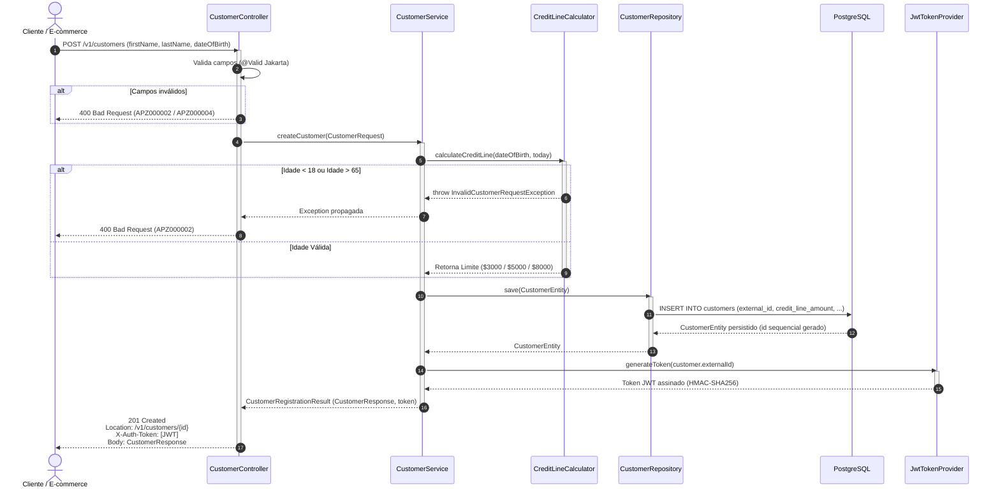

# Operação: Cadastro de Cliente (`POST /v1/customers`)

## 1. Visão de Produto e Negócio

### Objetivo
Permitir a entrada de novos clientes no ecossistema Buy Now, Pay Later (BNPL) da Aplazo, avaliando instantaneamente a elegibilidade e atribuindo uma linha de crédito inicial automática baseada na faixa etária do solicitante.

### Proposta de Valor
- **Onboarding sem atrito:** Processo instantâneo com decisão automática de crédito em tempo de requisição.
- **Autonomia para compras:** O cliente já recebe seu identificador único (`id`), limite de crédito aprovado e um token de autenticação JWT (`X-Auth-Token`) para realizar compras imediatamente.

### Regras de Negócio e Políticas de Crédito
1. **Faixa Etária de Aceitação:**
   - O cliente deve possuir idade entre **18 e 65 anos completos** no momento do cadastro.
   - Clientes com idade inferior a 18 anos ou superior a 65 anos são rejeitados com erro `400 Bad Request` e código de erro `APZ000002` (`INVALID_CUSTOMER_REQUEST`).
2. **Atribuição Automática de Linha de Crédito:**
   - **18 a 25 anos:** Crédito inicial de **$3.000,00**
   - **26 a 30 anos:** Crédito inicial de **$5.000,00**
   - **31 a 65 anos:** Crédito inicial de **$8.000,00**
3. **Disponibilidade Imediata:**
   - No momento da criação, o saldo disponível (`availableCreditLineAmount`) é igual à linha de crédito aprovada (`creditLineAmount`).
4. **Segurança e Continuidade:**
   - O endpoint é público (permite auto-cadastro).
   - A resposta inclui o cabeçalho `X-Auth-Token` com o JWT assinado contendo o UUID do cliente, permitindo consumo direto dos endpoints protegidos de empréstimo.

---

## 2. Diagrama de Sequência Interno (Mermaid)



---

## 3. Contrato da Requisição e Resposta

### Exemplo de Requisição
```http
POST /v1/customers HTTP/1.1
Content-Type: application/json

{
  "firstName": "Carlos",
  "lastName": "López",
  "secondLastName": "Pérez",
  "dateOfBirth": "1995-05-15"
}
```

### Exemplo de Resposta de Sucesso (HTTP 201 Created)
```http
HTTP/1.1 201 Created
Location: /v1/customers/3fa85f64-5717-4562-b3fc-2c963f66afa7
X-Auth-Token: eyJhbGciOiJIUzI1NiJ9...
Content-Type: application/json

{
  "id": "3fa85f64-5717-4562-b3fc-2c963f66afa7",
  "creditLineAmount": 5000.00,
  "availableCreditLineAmount": 5000.00,
  "createdAt": "2026-09-18T12:00:00Z"
}
```
